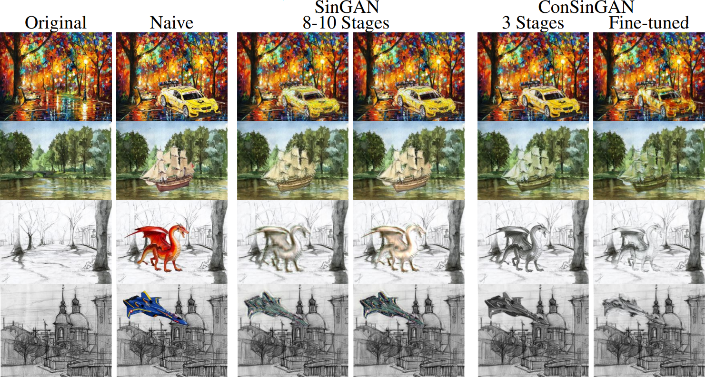

Title: GANs in Single Image Datasets: A Retrospective
Date: 2023-03-12 19:11
Tags: neural network, machine learning, GAN, image processing, deep learning, research paper
Category: Machine Learning
Slug: research-paper-retrospective
Authors: Dylan

With the recent publishing of my paper in the University of Minnesota Morris' Undergraduate Journal [Scholarly Horizons](https://digitalcommons.morris.umn.edu/horizons/), I thought now would be the perfect time for a retrospective of all the challenges I overcame in writing it and presenting it to my professors and peers. It was my first dip into writing that sort of formal academic paper, and though it was nerve-wracking many-a-time getting stumped along the way, it helped me in many ways, some I hadn't even considered before. The first of which is right at the very start of the journey itself: picking a topic.

You might ask: How can picking a topic be hard? I already knew I wanted to write something about machine learning, that's a topic enough, right? However, narrowing it down wasn't as simple as it might seem. The breadth of the topic had to be large enough that there were a couple papers to choose from, while being narrow enough of an idea to fit into just 6 pages of ACM format space, figures and all. Eventually, after pouring over countless academic papers on ACM, I finally came across one that checked all my boxes: [SinGAN](https://arxiv.org/abs/1905.01164).

Single Image Generative Adversarial Network (SinGAN) is exactly what it sounds like: A network capable of generating novel images from a training set of just a single image. Just from reading the synopsis, I knew it was the one, it broke a convention that I thought was a requirement for a GAN, and that is the massive amount of data usually needed to train the model. Not only that, but it was multifunctional to boot! Image harmonization, image editing, animation, image super-resolution, and so on. The results were impressive, too: 

     

Of course there are algorithms that can generate texture from a pattern, but this is different in that it's a machine learning model, and its multifunctionality is fascinating. Not only that, but there was a follow-up paper that developed SinGAN even further: [ConSinGAN](https://arxiv.org/pdf/2003.11512.pdf). To put it briefly (feel free to read my paper if you'd like more detail), ConSinGAN improves both image quality and the training time of SinGAN drastically by focusing on the earlier stages of the training process when the kernal and image size are small and the larger details of the image are being learned from the pyramid of convolutional GANs.

The real troubling difficulty of this paper presented itself immediately: I understood how it worked, but how was I going to put both papers into words that anyone with a data structures level of understanding computer science would understand in less than 6 pages? Let alone 20 minutes of presentation time? As with all huge tasks, it all began with breaking it down into its pieces, a tree of concepts that had to be explained from the root. In order to explain GANs, I needed to explain the layers, in order to explain the layers, I needed to introduce convolutional neural networks (CNNs), and in order to understand CNNs, I needed to introduce machine learning as a whole and all that entails.

Pouring over my sources, I wrote it from start to finish with the map of topics laid out, managing to squeeze in just enough terminology at the right time without being too technical. I hit walls, and I broke them. I revised, revised, revised. It was a humbling process that made me cross every t and dot every i to make sure I really did understand it as thoroughly as possible. The real fun was in the presentation, which pushed it to the limit by having to recite it on the spot to all of my peers.

The presentation itself, despite my cold feet, ended up being the best part of it all. I worked hard to assemble graphics for everything from the model itself to the concepts to be explained, because I had to condense all that information another magnitude further. Fortunately for me, I picked a very visual topic, and the beautiful generations and image harmonizations were perfect for it. All that work really paid off in the end too, as I got a distinction for both the paper and the presentation. Playing around with the model itself was also very informative, giving me more insight into PyTorch and all the ways it functioned. And with that, 'till next time!

     

