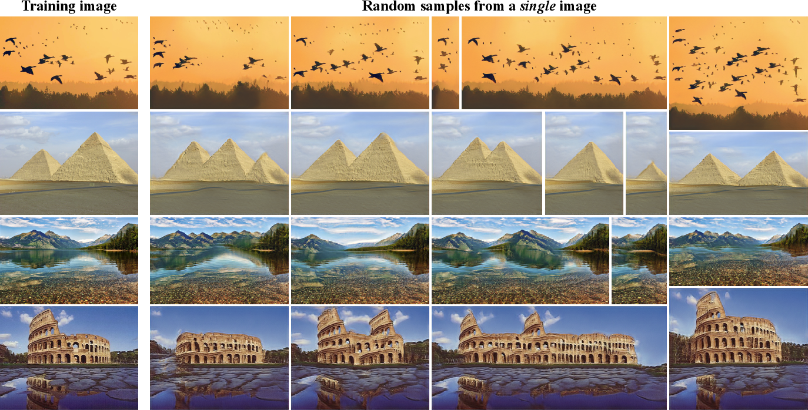

Title: GANs in Single Image Datasets: A Retrospective
Date: 2023-03-12 19:11
Tags: neural network, machine learning, GAN, image processing, deep learning, research paper
Category: Machine Learning
Slug: research-paper-retrospective
Authors: Dylan

With the recent publishing of my paper in the University of Minnesota Morris' Undergraduate Journal [Scholarly Horizons](https://digitalcommons.morris.umn.edu/horizons/), I thought now would be the perfect time for a retrospective of all the challenges I overcame in writing it and presenting it to my professors and peers. It was my first dip into writing that sort of formal academic paper, and though it was nerve-wracking many-a-time getting stumped along the way, it helped me in many ways, some I hadn't even considered before. The first of which is right at the very start of the journey itself: picking a topic.

You might ask: How can picking a topic be hard? I already knew I wanted to write something about machine learning, that's topic enough, right? However, narrowing it down wasn't as simple as it might seem. The breadth of the topic had to be large enough that there were a couple papers to choose from, while being narrow enough of an idea to fit into just 6 pages of ACM format space, figures and all. Eventually, after pouring over countless academic papers on ACM, I finally came across one that checked all my boxes: [SinGAN](https://arxiv.org/abs/1905.01164).

Single Image Generative Adversarial Network (SinGAN) is exactly what it sounds like: A network capable of generating novel images from a training set of just a single image. Just from reading the synopsis, I knew it was the one, it broke a convention I thought never could be broken, and that is the massive amount of data usually needed for a model like this. Not only that, but it was multifunctional to boot! Image harmonization, image editing, image superesolution, and on and on. The results were impressive, too: 

     

